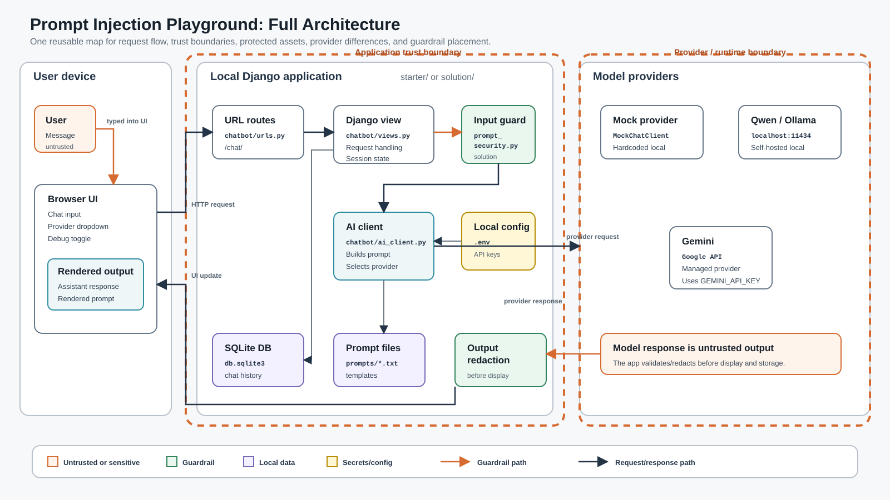

# Workshop 1 - AI Threat Modeling and Input Security

This folder contains the Session 1 distribution project and the instructor reference solution.

## Table Of Contents

- [Setup](docs/SETUP.md)
- [Exercises](docs/EXERCISES.md)
- [Attack Prompts](docs/ATTACK_PROMPTS.md)
- [Notes Template](docs/NOTES_TEMPLATE.md)
- [Slide Deck](session1_workshop_deck.html)
- [Distribution Code](starter)
- [Reference Solution](solution/)

## What To Distribute

Distribute only the vulnerable distribution code to participants.

Keep `solution/` as the instructor reference until the comparison step at the end of the workshop.

## Workshop Story

Participants start with a deliberately vulnerable themed chatbot. The vulnerable app copies the latest user message into the prompt as if it were trusted instructions. Participants attack that design, record evidence, then implement application-level defenses. The included sample theme is a campus-support assistant, but the project is built to swap themes without rewriting the app.

The fix should make user messages data, not trusted instructions.

## Architecture

## What The Solution Shows

The solution demonstrates:

- trusted policy separated from untrusted user text
- input blocking before model calls
- output redaction for the protected demo record
- plaintext chat history stored one message per row for this workshop
- tests for prompt construction, guardrail behavior, redaction, provider routing, and chat storage
- a scanner/checklist for the workshop findings

This is not a production security system. It is a compact lab for seeing why application controls still matter when a model provider has its own safety behavior.

## Main Files

- vulnerable distribution code: the code participants modify
- `solution/`: completed reference implementation
- `docs/SETUP.md`: environment, providers, database, and prompt files
- `docs/EXERCISES.md`: ordered participant work with timings
- `docs/ATTACK_PROMPTS.md`: reusable attack prompts based on AWS common prompt-injection categories
- `docs/NOTES_TEMPLATE.md`: tables for recording attack and defense observations
- `docs/starter-threat-model.md`: starter threat model diagram
- `docs/starter-trust-boundaries.md`: starter trust boundary diagram
- `docs/starter-security-decisions.md`: starter security decision map
- `docs/solution-threat-model.md`: solution threat model diagram
- `docs/solution-trust-boundaries.md`: solution trust boundary diagram
- `docs/solution-security-decisions.md`: solution security decision map
- `session1_workshop_deck.html`: instructor slide deck

## GenAI Coding Help

The exercise README includes optional GenAI prompts for both common workflows:

- VS Code or IDE agents that can read and edit files directly
- browser chat tools where participants paste file contents and ask for a patch or complete replacement output

See Exercises 8, 9, 10, and 13 in [docs/EXERCISES.md](docs/EXERCISES.md).

