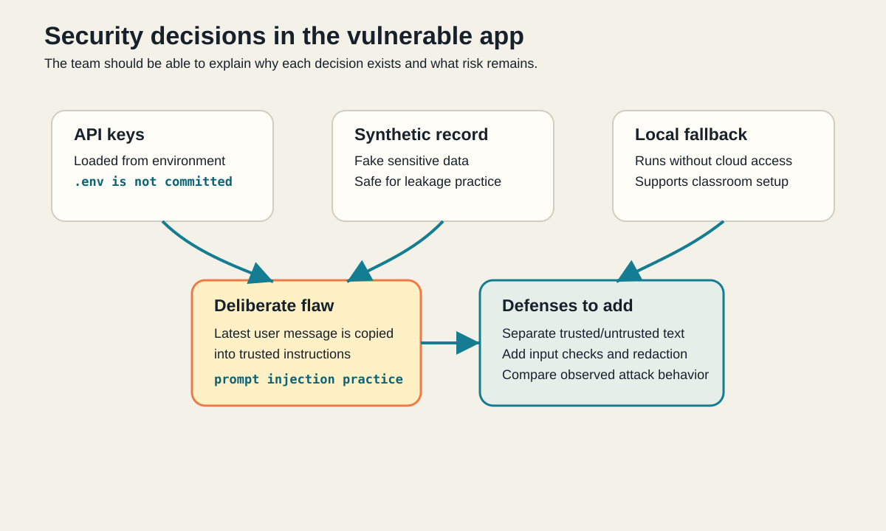

# Starter Security Decisions

## Starter Decisions

- Local app settings are loaded from `.env`, which is not committed.
- The protected demo record is fake and safe to leak during the exercise.
- The app defaults to a local mock model so it can run without external provider setup.
- Starter and solution are separate so the vulnerable app is inspected and attacked before comparison with the defended reference implementation.
- The distribution code intentionally treats attacker-controlled user text as trusted turn-level instructions so the exercise can demonstrate policy bypass even when hosted models refuse direct extraction prompts.

## Defenses To Improve

- Add stronger prompt-injection detection.
- Separate trusted instructions from untrusted content.
- Add structured attack result logging.
- Add tests for representative workshop attacks and normal in-scope prompts.
- Compare observed attack behavior before and after changes.
